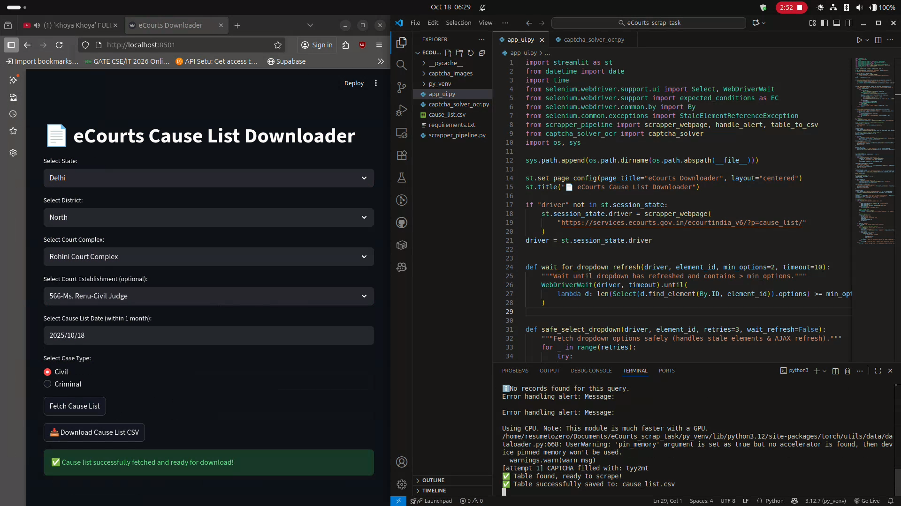

# eCourts Cause List Downloader

A user-friendly **Streamlit web application** designed to scrape and download **cause lists** from the official [eCourts Services](https://services.ecourts.gov.in/ecourtindia_v6/?p=cause_list/) portal in India. It automates the selection of states, districts, court complexes, and other filters, solves CAPTCHAs using OCR, and exports the results as a downloadable CSV file.

This tool is particularly useful for legal professionals, researchers, or anyone needing quick access to daily court cause lists (civil or criminal cases) without manual browser navigation.

## 🚀 Features

- **Interactive UI**: Easy dropdown selections for State, District, Court Complex, Court Establishment, Date, and Case Type (Civil/Criminal).
- **Automated CAPTCHA Solving**: Uses OpenCV, Tesseract, and EasyOCR for robust image preprocessing and text recognition. Supports retries and voting for accuracy.
- **Selenium-Powered Scraping**: Handles dynamic web elements, AJAX refreshes, alerts, and stale references gracefully.
- **CSV Export**: Extracts table data into a clean, downloadable CSV file with headers and rows.
- **Error Handling**: Graceful fallbacks for no data, failed CAPTCHAs, or page issues.
- **Session Persistence**: Maintains browser state across interactions.
- video: https://drive.google.com/file/d/1DBMu2fgTCS_kDekqvV7I1hgWgAWmwERp/view?usp=drive_link

## 📋 Prerequisites

- Python 3.8+ (tested with 3.12)
- Chrome/Chromium browser installed (uses headless mode; binary at `/usr/bin/chromium-browser` by default—adjust if needed).
- No additional setup for CAPTCHA solver (uses CPU by default; GPU optional via EasyOCR).

## 🛠 Installation

1. **Clone the Repository**:
   ```bash
   git clone <your-repo-url>
   cd ecourts-downloader
   ```

2. **Install Dependencies**:
   Create a virtual environment (recommended) and install packages:
   ```bash
   python -m venv venv
   source venv/bin/activate  # On Windows: venv\Scripts\activate
   pip install -r requirements.txt
   ```

   Key dependencies include:
   - `streamlit` for the UI
   - `selenium` for web automation
   - `opencv-python`, `pytesseract`, `easyocr` for CAPTCHA solving
   - `beautifulsoup4` for HTML parsing

3. **Install Tesseract OCR** (required for CAPTCHA):
   - **Ubuntu/Debian**: `sudo apt install tesseract-ocr`
   - **macOS**: `brew install tesseract`
   - **Windows**: Download from [GitHub](https://github.com/UB-Mannheim/tesseract/wiki) and add to PATH.

## ▶️ Usage

1. **Run the App**:
   ```bash
   streamlit run app_ui.py
   ```
   This launches the app at `http://localhost:8501`.

2. **Step-by-Step in the UI**:
   - Select your **State** from the dropdown (fetches dynamically).
   - Choose **District**, **Court Complex**, and optionally **Court Establishment**.
   - Pick a **Cause List Date** (must be within the last month).
   - Select **Case Type**: Civil or Criminal.
   - Click **Fetch Cause List**.
     - The app solves the CAPTCHA automatically (may take a few seconds).
     - If successful, a **Download CSV** button appears.

3. **Output**:
   - CSV file named `cause_list.csv` with columns like Case Number, Party Names, Advocates, etc.
   - Handles "No Data" warnings gracefully.

### Example Workflow
- State: Delhi → District: New Delhi → Court Complex: Patiala House → Date: Today → Criminal → Fetch → Download.

## 📁 Project Structure

- `app_ui.py`: Main Streamlit interface and dropdown logic.
- `captcha_solver_ocr.py`: Advanced CAPTCHA solver with image preprocessing and multi-OCR voting.
- `scrapper_pipeline.py`: Selenium setup, alert handling, and table-to-CSV extraction.
- `requirements.txt`: All Python dependencies.

## 🖼 Screenshots



## ⚠️ Limitations & Notes

- **Rate Limiting**: eCourts may block aggressive scraping—use responsibly and with delays.
- **CAPTCHA Accuracy**: ~80-90% success rate; manual refresh if fails after retries.
- **Date Range**: Limited to the last 30 days per eCourts policy.
- **Headless Mode**: Runs without a visible browser; set `chrome_options.headless = False` for debugging.
- **Legal Compliance**: This tool is for personal/educational use. Respect eCourts' terms of service and data privacy laws.

## 🔧 Troubleshooting

- **Dropdown Empty?** Ensure stable internet; the app waits for AJAX loads.
- **CAPTCHA Fails?** Try enabling GPU (`use_gpu=True` in `captcha_solver`) or increase attempts.
- **Selenium Errors?** Verify Chrome path; install `chromedriver` if using non-headless.
- **No Table?** Check console for "NoData" or retry with different filters.

## 🤝 Contributing

Contributions welcome! Fork the repo, make changes, and submit a PR.

1. Install dev tools: `pip install -r requirements.txt`.
2. Run tests (add them in future).
3. Follow PEP 8 style.

Issues? Open a ticket with error logs.

## 📄 License

MIT License - see [LICENSE](LICENSE) for details.
